# Orrery architecture — as implemented

This document describes the code that exists in this repository on **16 July 2026**. It is not a product roadmap. When a planning document or a UI mock disagrees with executable code, the code wins here.

The diagrams are intentionally split by responsibility. Each one answers one question instead of connecting every feature to every other feature.

## Status language

| Status | Meaning |
|---|---|
| **Live** | The UI calls a registered API route and the backend implementation exists. |
| **Backend only** | The domain code exists, but there is no registered API route or working product UI for it. |
| **Static UI** | The React screen is a visual mock with hard-coded data and no backend calls. |
| **Conditional** | The path works only when a feature flag, local service, or provider is available. |

---

## 1. The system at a glance

Orrery is a local desktop application. A React UI talks to a Python API on loopback. PostgreSQL is the durable application store, the OS keychain holds secrets, and generated binaries live in the per-user data directory.

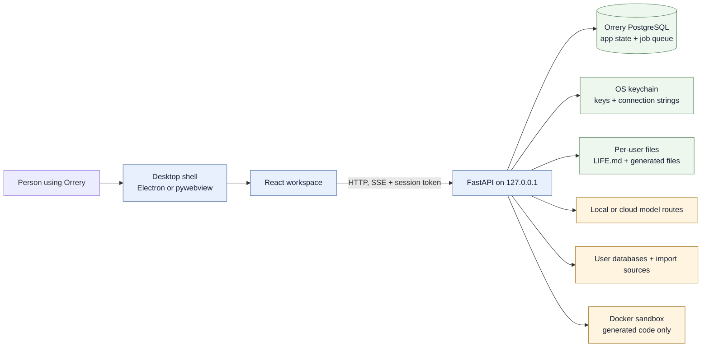

Code anchors: `desktop/electron/main.cjs`, `desktop/electron/preload.cjs`, `app.py`, `backend/api/__init__.py`, `backend/core/database.py`, `backend/core/paths.py`.

---

## 2. Desktop startup

The packaged Electron application owns the window and launches the Python backend as a child process. The source-mode fallback starts the same backend in a thread and opens it with pywebview.

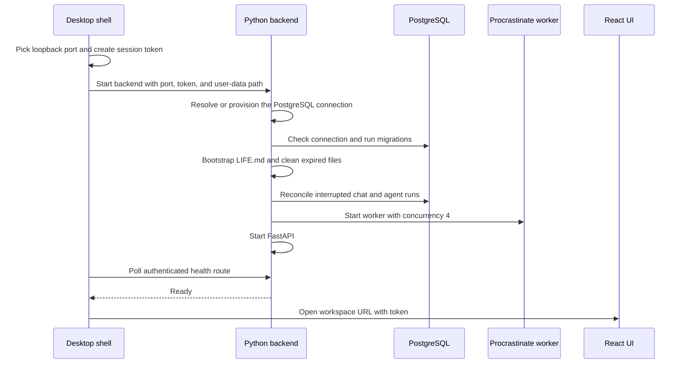

Startup facts:

- Electron uses an ephemeral port by default and a random 32-byte session token.
- `ORRERY_DATA_DIR` points packaged builds at Electron's user-data directory.
- The backend can auto-provision Orrery's local PostgreSQL through Docker.
- The API server and job worker run in the same Python process.
- Electron uses `contextIsolation: true` and `nodeIntegration: false`; its renderer setting is currently `sandbox: false`.

Code anchors: `desktop/electron/main.cjs`, `app.py`, `backend/core/dockerboot.py`, `backend/core/migrations.py`, `backend/core/queue.py`.

---

## 3. Request boundary

Normal application routes require the per-launch `X-Orrery-Token`. Team identity is a second layer: in team mode the stored team access key identifies an owner and role.

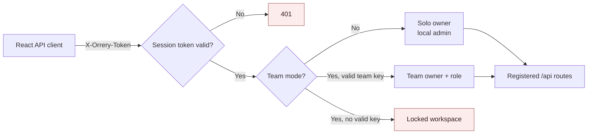

The registered API modules cover system health, models, providers, local models, app settings, data, dashboards, collections, skills, MCP, team/admin, agents, projects, conversations, files, shared tools, and LIFE.

Two read-only serving paths deliberately sit outside token authentication because sandboxed iframes cannot attach the header:

- `/artifacts/{id}` for temporary previews.
- `/api/apps/{id}/{path}` for approved local app bundles.

Both are loopback-only and use unguessable IDs. Their browser policies are different and are shown in the security section.

Code anchors: `backend/api/__init__.py`, `backend/api/deps.py`, `ui/src/lib/api.js`, `backend/features/team.py`.

---

## 4. Product surface: what is actually connected

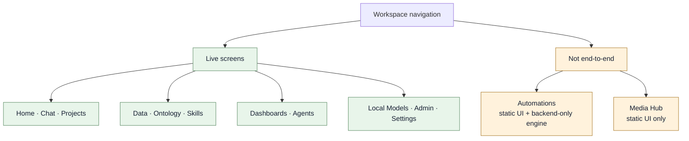

| Surface | Status | Evidence from the implementation |
|---|---|---|
| Home | Live | Loads conversations, projects, data sources, collections, models, tasks, and defaults. |
| Chat | Live | Conversation CRUD, SSE generation, attachments, projects, RAG, tools, files, previews, and versioned messages. |
| Projects | Live | CRUD, instructions, project files, and project-scoped chat context. |
| Data | Live | External connections, table browsing, imported datasets, and document collections. |
| Ontology | Live | Collection CRUD, ingestion, and connected standing knowledge. |
| Skills and MCP | Live | Skill CRUD/generation and stdio MCP configuration, discovery, and tool calls. |
| Dashboards | Live | AI-authored specs, read-only execution, layout saves, revisions, rollback, and data models. |
| Agents | Live | Versioned definitions, manual/scheduled runs, trace, budgets, cancellation, and approvals. |
| Local Models | Live | Ollama detection, install/start on Windows, pull, activate, and remove. |
| Admin and Settings | Live | Team access, feature gates, providers, privacy, spending, updates, MCP, and LIFE review. |
| Automations | Backend only + static UI | Workflow storage and execution exist, but no workflow router is registered and the React view uses hard-coded arrays. |
| Media Hub | Static UI | The screen has no API imports and its Generate button has no backend handler. Chat can still create image, audio, and video files through its own artifact pipeline. |

Code anchors: `ui/src/App.jsx`, `ui/src/views`, `backend/api/__init__.py`.

---

## 5. A normal Chat turn

The chat route first saves the user's turn, then chooses one dedicated route. Only the normal reply path enters the general model/tool loop.

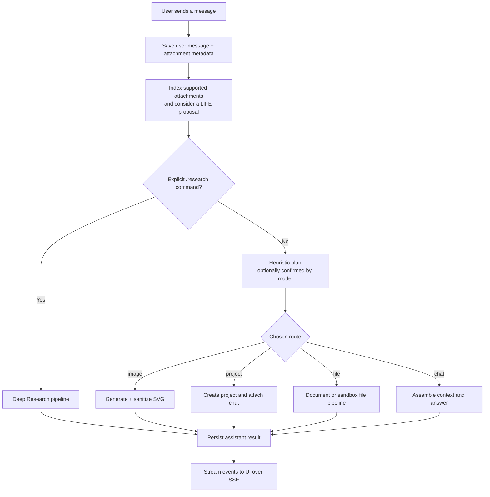

Important boundaries:

- Chat does **not** have a direct route for starting an agent or running a workflow.
- Chat does **not** create dashboards. When the model-guided capability flag is enabled, it can query data or refresh an existing dashboard.
- `/research` is an explicit command, not an automatic mode.
- A client disconnect does not cancel generation: the in-process run continues and persists the answer. The user must press Stop to cancel it.
- Only detached chat runs currently create rows in the Task Brain ledger, despite the broader wording in that module's docstring.

Code anchors: `backend/features/chat/router.py`, `backend/features/taskrouter.py`, `backend/features/chat/runs.py`, `backend/features/taskbrain.py`.

---

## 6. Chat context assembly

Orrery keeps instruction authority separate from retrieved material. Project instructions are trusted context; documents, web results, database rows, and tool output are untrusted reference data.

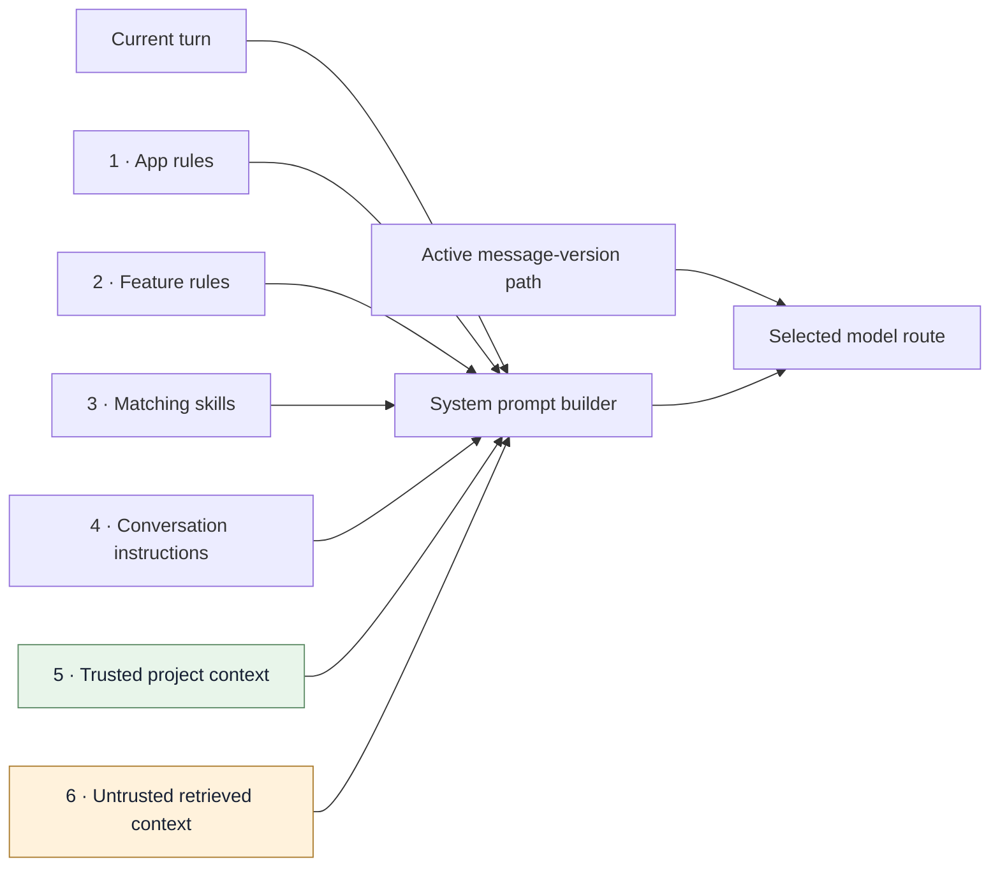

Retrieval searches these collections together when relevant:

1. The collection selected with “use my data”.
2. Files attached to the current project.
3. Files previously uploaded to this conversation.
4. Connected ontologies, when enabled.

The active conversation path is a tree of message versions. Edit/regenerate creates siblings; only the active branch is sent back to the model. The recent history tail is bounded, and older uploaded files return through retrieval rather than being inlined forever.

`LIFE.md` is **not currently injected into normal Chat prompts**. Chat can asynchronously propose learned facts, but the user must approve the exact diff in Settings before the file changes.

Code anchors: `backend/features/prompting.py`, `backend/features/chat/retrieval.py`, `backend/features/chat/router.py`, `backend/features/chat/versioning.py`, `backend/features/life_learn.py`.

---

## 7. Model routing

All model-backed features call the same provider boundary. That boundary applies privacy handling, authentication, streaming, reasoning separation, usage metering, and one limited fallback rule.

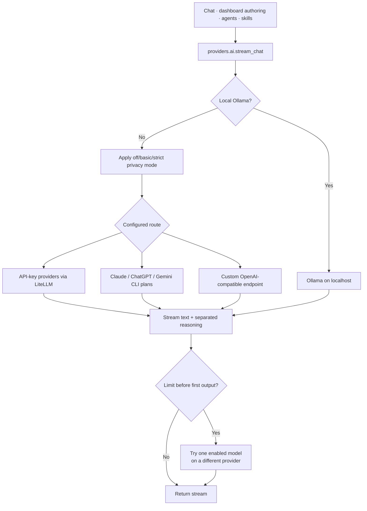

API-key providers in code: Anthropic, OpenAI, Google, Mistral, DeepSeek, and OpenRouter. Local models use Ollama. Custom routes must pass the server-side URL safety check and expose an OpenAI-compatible API.

The fallback is deliberately narrow: it happens only for recognized provider-limit failures, only before any output is emitted, only for text-compatible input, and only once.

Code anchors: `backend/providers/ai.py`, `backend/providers/accounts.py`, `backend/providers/catalog.py`, `backend/security/privacy.py`, `backend/security/netguard.py`, `backend/features/usage.py`.

---

## 8. The Chat tool loop

The model requests tools through fenced JSON blocks. The backend parses the request and enforces the turn's allow-list before executing it.

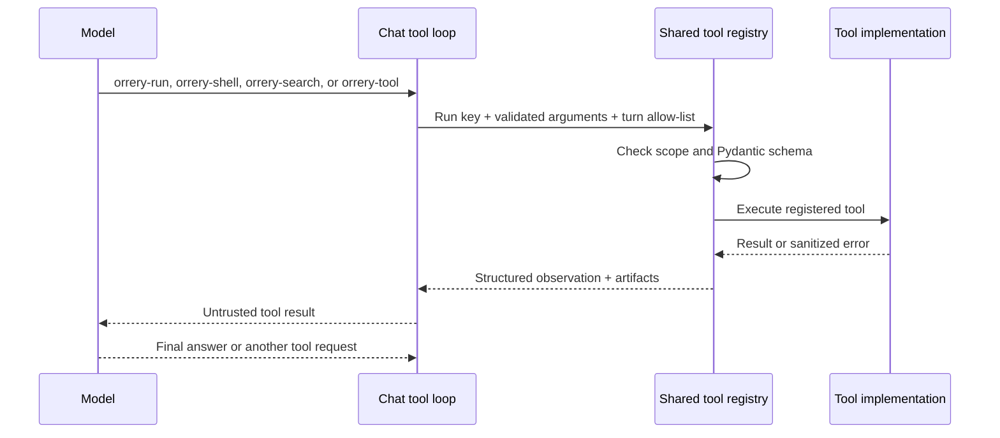

Registered tools:

| Tool | Purpose | Main enforcement |
|---|---|---|
| `web_search` | Current web lookup | Turn allow-list; network risk label. |
| `doc_search` | Search a collection | Collection resource constraint for agents. |
| `db_query` | One read-only query | SQL parse gate plus database-enforced read-only path. |
| `run_python` | Python in Docker | Offline hardened container and output caps. |
| `run_shell` | Shell in Docker | Same hardened container. |
| `file_generate` | Produce validated files | Sandbox, format validators, and artifact storage. |
| `crabbox_run` | Optional external executor | Off by default; destructive risk. |
| `dashboard_refresh` | Run an existing dashboard | Dashboard resource constraint for agents. |
| `mcp_call` | Call a stdio MCP tool | Chat advertises only enabled/approved servers; agent grants can constrain the server ID. |

Current Chat gating matters:

- Web search and approved MCP calls can be offered without the model-guided capability flag.
- File, data, document, dashboard, and Crabbox tools are added only when `capability_agent` is enabled; it defaults to off.
- The general tool loop currently runs only when the Docker sandbox is ready **and** Chat code execution is enabled. Otherwise Chat falls back to a plain model response, so web and MCP tools are not reached through this loop either.

Code anchors: `backend/features/code_interpreter.py`, `backend/features/capabilities.py`, `backend/tools/registry.py`, `backend/tools/builtin.py`, `backend/features/chat/router.py`.

---

## 9. File and small-app generation

Documents may use the deterministic document builder. Code-heavy files and small apps use a repairable model → sandbox → validation pipeline.

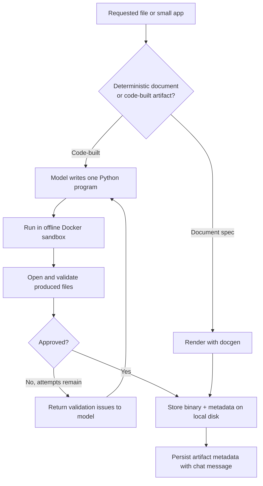

The Docker execution boundary uses no network, a read-only root filesystem, a non-root user, dropped Linux capabilities, no privilege escalation, CPU/memory/PID limits, a wall-clock timeout, and a bounded `/work/out` handoff.

Small apps receive extra controls:

- A validated local bundle with `index.html` and at most 12 files.
- No external references, fetch/XHR/WebSocket, browser storage, inline event handlers, or unsupported browser capabilities.
- A ZIP for download plus a private extracted directory for preview.
- An opaque-origin iframe and a `connect-src 'none'` CSP when opened.

Generated files live under the per-user `tmp/generated` directory and expire after the configured TTL, seven days by default. File bytes are not stored in PostgreSQL.

Code anchors: `backend/features/docgen.py`, `backend/features/filegen.py`, `backend/features/sandbox.py`, `backend/features/files.py`, `backend/features/filepreview.py`.

---

## 10. Connected data and imported datasets

External database connections remain external. Imports are copied into isolated schemas inside Orrery's PostgreSQL so dashboards can query them through the same read-only interface.

### External connections

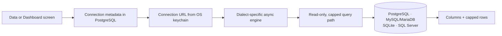

Read-only enforcement differs by dialect:

- PostgreSQL: `SET TRANSACTION READ ONLY` plus an 8-second statement timeout.
- MySQL/MariaDB: read-only session initialization plus a best-effort execution timeout.
- SQLite: `PRAGMA query_only = ON`.
- SQL Server: no session read-only mode is available here; Orrery relies on a read-only login and the single-SELECT parser used by dashboard/tool paths.

### Imported datasets

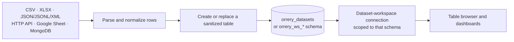

API headers and MongoDB URIs are stored in the keychain. Dataset API URLs pass the server-side network guard; in team mode, imports cannot probe private or loopback networks. Values are parameterized and identifiers are sanitized during materialization.

Code anchors: `backend/features/data.py`, `backend/features/datasets.py`, `backend/security/netguard.py`.

---

## 11. Document ingestion and retrieval

Large document uploads are spooled to disk and queued. Retrieval combines vector similarity and PostgreSQL full-text search, then drops unrelated vector hits.

### Ingestion

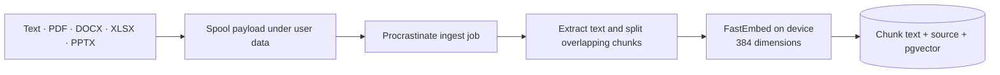

### Retrieval

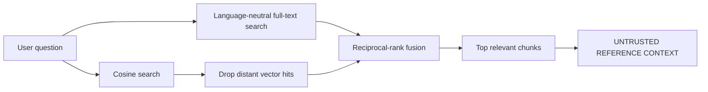

Each collection records its embedding model so older and newer collections can be searched in the correct vector space. Re-uploading the same source replaces its chunks transactionally.

Code anchors: `backend/features/rag.py`, `backend/features/chat/retrieval.py`, `backend/core/models.py`, `backend/core/queue.py`.

---

## 12. Dashboard lifecycle

The model designs a saved specification; it does not render live data itself. Every open or refresh runs the saved SQL again through the read-only data layer.

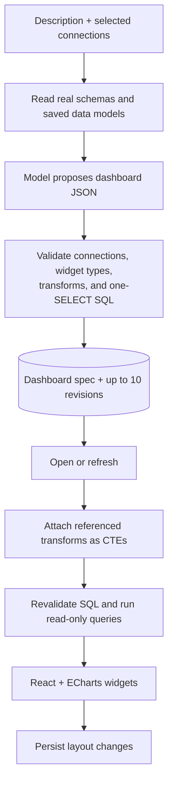

One broken widget produces a local widget error rather than failing the whole dashboard. Revisions are model-assisted; ordinary refreshes make no model call. Cross-connection joins are not allowed inside one transform.

Code anchors: `backend/features/dashboards.py`, `backend/features/datamodels.py`, `backend/features/data.py`, `ui/src/views/Dashboards.jsx`.

---

## 13. Agent execution

Agents are implemented as durable, version-pinned model/tool loops. A run never receives more tools than its saved grants allow.

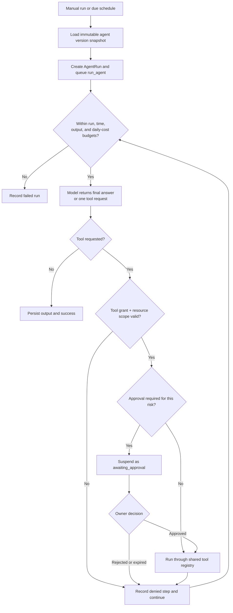

Implemented triggers are:

- Manual runs from the Agents UI.
- Cron schedules checked once per minute by the queue worker.

The data model and builder accept `api`, `slack`, and `gmail` trigger modes and connector grants, but there is no inbound agent API, Slack receiver, or Gmail receiver registered in this codebase. `AgentApiCredential` storage exists but is not used by a route. Likewise, agent `life_access` settings are validated but not consumed by the current run loop.

Code anchors: `backend/features/agents.py`, `backend/features/agent_runs.py`, `backend/api/routes_agents.py`, `backend/core/queue.py`, `backend/core/models.py`.

---

## 14. Automation engine — backend only

The workflow domain and executor are real, but the product connection is missing. This diagram describes the callable backend code, not the current Automations screen.

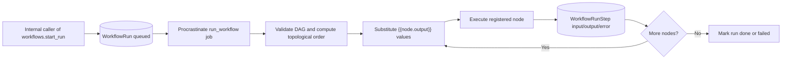

Registered node types are `llm_prompt`, `search_docs`, `db_query`, `http_request`, `run_python`, `run_shell`, `web_search`, `if_branch`, `delay`, `refresh_dashboard`, and `mcp_tool`.

Current gaps are explicit:

- `backend/features/workflows.py` is not exposed by any registered FastAPI router.
- `ui/src/views/Automations.jsx` uses hard-coded workflows, nodes, edges, settings, and run history.
- The saved workflow `schedule` field says “wired later”; there is no workflow schedule tick.
- The mock UI shows triggers, retries, POST requests, database writes, and Slack behavior that the current node registry does not provide.

Code anchors: `backend/features/workflows.py`, `backend/automation/engine.py`, `backend/automation/nodes.py`, `backend/api/__init__.py`, `ui/src/views/Automations.jsx`.

---

## 15. Durable background work

Only work that is actually registered with the queue is shown here.

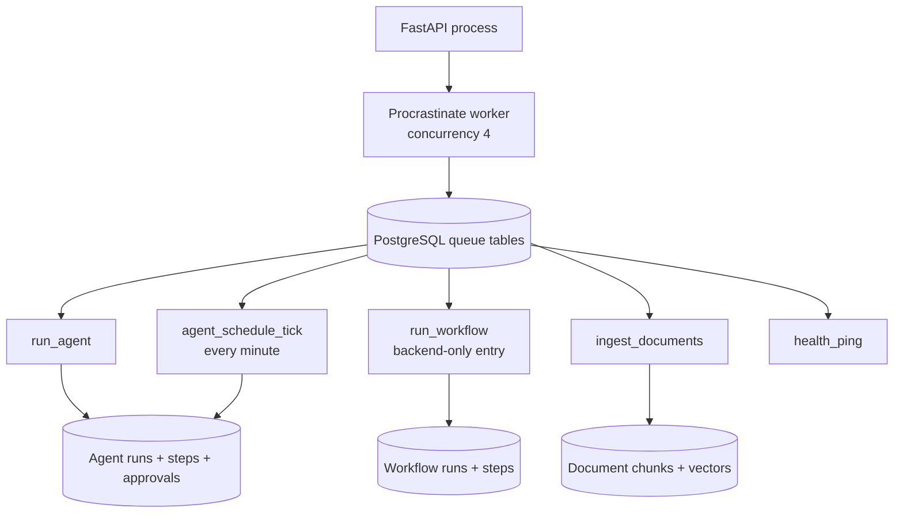

Chat generation is different: it is detached into an in-process `asyncio.Task`, not placed on Procrastinate. It survives navigation and client disconnects but not a backend process exit. On the next launch, stale running Task Brain rows are marked interrupted.

Code anchors: `backend/core/queue.py`, `backend/features/chat/runs.py`, `backend/features/taskbrain.py`, `backend/features/agent_runs.py`.

---

## 16. Storage ownership

```mermaid
flowchart TB
    pg[("Orrery PostgreSQL")]
    pg --> p1["Chats · projects · messages · versions"]
    pg --> p2["Collections · chunks · embeddings"]
    pg --> p3["Connections metadata · datasets · dashboards"]
    pg --> p4["Skills · MCP metadata · feature settings"]
    pg --> p5["Agents · approvals · workflows · queue jobs"]
    pg --> p6["Team users · LIFE proposals · usage events"]

    keychain["OS keychain"]
    keychain --> k1["Main PostgreSQL URL"]
    keychain --> k2["Provider and custom-model keys"]
    keychain --> k3["External DB URLs · dataset secrets"]
    keychain --> k4["MCP environment values · team unlock key"]

    disk["Per-user data directory"]
    disk --> d1["LIFE.md + content-addressed history"]
    disk --> d2["Generated files + app bundles + previews"]
    disk --> d3["Ingestion spool · logs · webview data"]
```

External database rows remain in their original systems unless the user explicitly imports them as datasets. Provider secrets, database passwords, MCP environment values, and team plaintext access keys are not stored in application tables.

Code anchors: `backend/core/models.py`, `backend/security/secrets.py`, `backend/features/files.py`, `backend/features/life.py`, `backend/features/datasets.py`.

---

## 17. Security boundaries

### Cloud model boundary

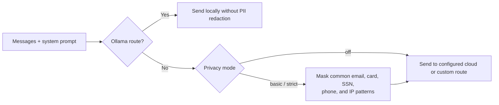

“Strict” currently uses the same regex redaction implementation as “basic”; it is a hook for a broader detector, not a stronger detector today.

### Generated preview boundary

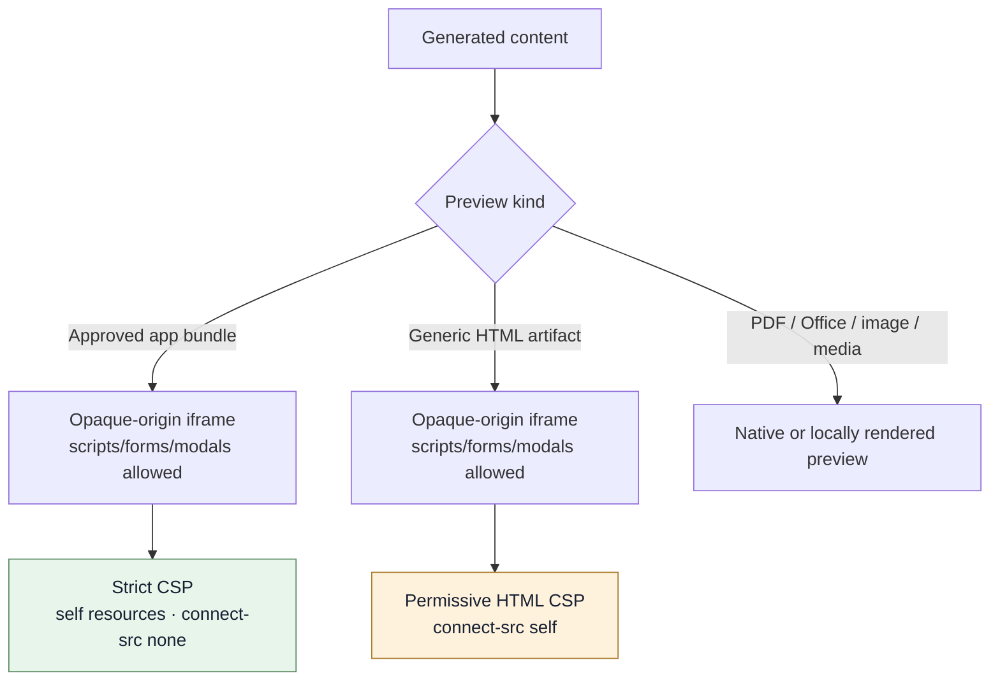

The app-bundle path has the strong no-egress contract. Generic HTML previews do **not** have the same CSP: they allow inline script/eval and broad image/media/font sources, although the opaque-origin iframe prevents access to the parent workspace and `connect-src` is limited to self.

Other implemented controls include:

- Loopback-only API binding and a fresh session token per launch.
- Request-size caps, no API docs/OpenAPI surface, CSP, frame, MIME-sniffing, and referrer headers.
- OS-keychain secret storage and error-string secret scrubbing.
- Team keys stored as SHA-256 hashes; the local unlock copy stays in the keychain.
- Owner filtering for private team resources and admin approval for member-authored skills/MCP servers.
- Server-side URL guards for custom model endpoints and import/HTTP fetches.
- Untrusted-context labeling for retrieved documents and tool output.
- Read-only query enforcement and row/time caps for connected data.
- Hardened offline Docker execution for model-written code.

Code anchors: `backend/api/__init__.py`, `backend/security`, `backend/features/team.py`, `backend/features/prompting.py`, `backend/features/sandbox.py`, `ui/src/lib/officePreview.js`.

---

## 18. The honest implementation boundary

```mermaid
flowchart LR
    live["Live end-to-end"] --> a["Chat · projects · data · RAG"]
    live --> b["Dashboards · agents · skills · MCP"]
    live --> c["Models · team/admin · settings · LIFE review"]

    partial["Present but incomplete"] --> d["Automations<br/>engine without API/product wiring"]
    partial --> e["Media Hub<br/>static presentation only"]
    partial --> f["Agent API/Slack/Gmail triggers<br/>schema/config without receivers"]
    partial --> g["LIFE in agent config<br/>not used by run loop"]
```

In plain English: Orrery already has a substantial local-first core. Chat, retrieval, data, dashboards, file generation, model routing, team controls, MCP, and bounded agents are implemented. The largest architectural mismatch is not inside those systems; it is at the product edge, where Automations and Media look connected in the UI but are not yet wired end to end.

That distinction should remain visible in future diagrams so the architecture describes the software people can actually run—not the software the mockups imply.
