# Orrery architecture — as implemented

This document describes the code that exists in this repository on **24 August 2026**. It is the
single source of truth for implemented architecture, not a product roadmap. Future work belongs in
[`PLAN.md`](PLAN.md) and [`TODO.md`](TODO.md). When a plan or UI mock disagrees with executable code,
the code wins here.

The diagrams are intentionally split by responsibility. Each one answers one question instead of connecting every feature to every other feature.

## Status language

| Status | Meaning |
|---|---|
| **Live** | The UI calls a registered API route and the backend implementation exists. |
| **Backend only** | The domain code exists, but there is no registered API route or working product UI for it. |
| **Static UI** | The React screen is a visual mock with hard-coded data and no backend calls. |
| **Conditional** | The path works only when a feature flag, local service, or provider is available. |

---

## 1. The system at a glance

Orrery is a local application that serves its workspace to the user's own browser. A React UI talks to a Python API on loopback. PostgreSQL is the durable application store, the OS keychain holds secrets, and generated binaries live in the per-user data directory.

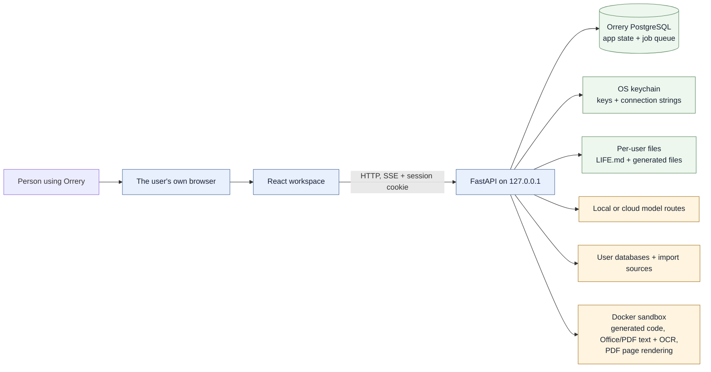
```mermaid
flowchart LR
    user["Person using Orrery"] --> browser["The user's own browser"]
    browser --> ui["React workspace"]
    ui -->|"HTTP, SSE + session cookie"| api["FastAPI on 127.0.0.1"]

    api --> pg[("Orrery PostgreSQL<br/>app state + job queue")]
    api --> keychain["OS keychain<br/>keys + connection strings"]
    api --> disk["Per-user files<br/>LIFE.md + generated files"]

    api --> models["Local or cloud model routes"]
    api --> sources["User databases + import sources"]
    api --> docker["Docker sandbox<br/>generated code, Office/PDF text + OCR,<br/>PDF page rendering"]

    classDef core fill:#e8f0fe,stroke:#4f6f9f,color:#172033;
    classDef store fill:#edf7ed,stroke:#5f8a65,color:#172033;
    classDef external fill:#fff4df,stroke:#a77b2d,color:#172033;
    class browser,ui,api core;
    class pg,keychain,disk store;
    class models,sources,docker external;
```

Code anchors: `app.py`, `backend/api/__init__.py`, `backend/security/session.py`, `backend/core/database.py`, `backend/core/paths.py`.

---

## 2. Startup

`orrery web` starts the backend in a thread, waits for it to become ready, and opens the user's browser at the loopback URL. Nothing renders in-process: there is no window to own.

```mermaid
sequenceDiagram
    participant L as orrery web
    participant B as Python backend
    participant P as PostgreSQL
    participant Q as Procrastinate worker
    participant U as The user's browser

    L->>L: Resolve loopback port, session token, and a single-use launch code
    L->>B: Start the backend in a thread
    B->>B: Resolve or provision the PostgreSQL connection
    B->>P: Check connection and run migrations
    B->>B: Bootstrap LIFE.md and clean expired files
    B->>P: Reconcile interrupted chat and agent runs
    B->>Q: Start worker with concurrency 4
    B->>B: Mount declared plugins (a failure stops startup)
    B->>B: Warm model metadata in a worker thread
    B->>B: Start FastAPI
    B-->>L: Ready
    L->>U: Open http://127.0.0.1:<port>/?c=<launch code>
    U->>B: POST /api/session/claim
    B-->>U: httpOnly session cookie; launch code rotated
    U->>U: Strip the code out of the address bar
```

Startup facts:

- The configured port is preferred, with a free-port fallback so a second Orrery never dies on bind.
- A random 32-byte session token is minted per launch; the browser never sees it.
- `ORRERY_DATA_DIR` overrides the per-user data directory.
- The backend can auto-provision Orrery's local PostgreSQL through Docker.
- `GET /api/health` is bounded: `check_connection` gives up after `HEALTH_TIMEOUT_SECONDS` and reports `database: error` rather than waiting, so a database that is down is reported instead of hanging the endpoint that reports it.
- The API server and job worker run in the same Python process.
- `orrery web --no-browser` starts everything and prints the URL instead of opening a browser.

Code anchors: `app.py`, `backend/security/session.py`, `backend/core/dockerboot.py`, `backend/core/migrations.py`, `backend/core/queue.py`.

---

## 3. Request boundary

Normal application routes accept the per-launch session either as the `X-Orrery-Token` header or as the httpOnly session cookie the workspace holds. Cookie-authenticated requests additionally carry an Origin check, because cookies ignore port: `http://127.0.0.1:<other port>` is same-site with Orrery, so `SameSite=Strict` alone would let another local process drive the API. Header-authenticated requests need no such check, since a cross-origin page cannot set a custom header without a CORS preflight Orrery never grants. Team identity is a second layer: in team mode the stored team access key identifies an owner and role.

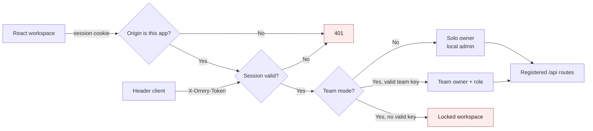
```mermaid
flowchart LR
    ui["React workspace"] -->|"session cookie"| origin{"Origin is this app?"}
    client["Header client"] -->|"X-Orrery-Token"| auth
    origin -->|"No"| reject["401"]
    origin -->|"Yes"| auth{"Session valid?"}
    auth -->|"No"| reject
    auth -->|"Yes"| identity{"Team mode?"}
    identity -->|"No"| solo["Solo owner<br/>local admin"]
    identity -->|"Yes, valid team key"| member["Team owner + role"]
    identity -->|"Yes, no valid key"| locked["Locked workspace"]
    solo --> routes["Registered /api routes"]
    member --> routes

    classDef stop fill:#fdecec,stroke:#a65b5b,color:#321b1b;
    class reject,locked stop;
```

The registered API modules cover system health, models, providers, local models, app settings, data, dashboards, collections, skills, MCP, team/admin, agents, Automations, projects, conversations, files, shared tools, and LIFE.

Two read-only serving paths deliberately sit outside token authentication because sandboxed iframes cannot attach the header:

- `/artifacts/{id}` for temporary previews.
- `/api/apps/{id}/{path}` for approved local app bundles.

Both are loopback-only and use unguessable IDs. Their browser policies are different and are shown in the security section.

Code anchors: `backend/api/__init__.py`, `backend/api/deps.py`, `backend/security/session.py`, `ui/src/lib/api.js`, `backend/features/team.py`.

---

## 4. Product surface: what is actually connected

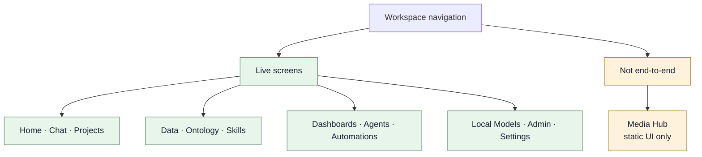
```mermaid
flowchart TB
    shell["Workspace navigation"]

    shell --> live["Live screens"]
    live --> l1["Home · Chat · Projects"]
    live --> l2["Data · Ontology · Skills"]
    live --> l3["Dashboards · Agents · Automations"]
    live --> l4["Local Models · Admin · Settings"]

    shell --> partial["Not end-to-end"]
    partial --> m["Media Hub<br/>static UI only"]

    classDef liveStyle fill:#e8f5ea,stroke:#5b8a64,color:#172033;
    classDef partialStyle fill:#fff2dc,stroke:#aa7b2c,color:#172033;
    class live,l1,l2,l3,l4 liveStyle;
    class partial,m partialStyle;
```

| Surface | Status | Evidence from the implementation |
|---|---|---|
| Home | Live | Loads conversations, projects, data sources, collections, models, tasks, and defaults. |
| Chat | Live | Conversation CRUD, SSE generation, attachments, projects, RAG, tools, files, previews, and versioned messages. |
| Projects | Live | CRUD, instructions, project files, and project-scoped chat context. |
| Data | Live | External connections, table browsing, imported datasets, and document collections. |
| Ontology | Live | Collection CRUD, ingestion, and connected standing knowledge. |
| Skills and MCP | Live | Skill CRUD/generation and approved stdio MCP configuration, discovery, and tool calls. HTTP transport is not implemented. |
| Dashboards | Live | AI-authored specs, read-only execution, layout saves, revisions, rollback, and data models. |
| Agents | Live | Versioned definitions, manual/scheduled runs, trace, budgets, cancellation, and approvals. |
| Local Models | Live | Ollama detection, install/start on Windows, pull, activate, and remove. |
| Admin and Settings | Live | Team access, feature gates, providers, privacy, spending, updates, MCP, and LIFE review. |
| Automations | Live read/run surface; editor incomplete | Authenticated CRUD, the registered node catalog, manual runs, durable run steps, and the React read/run view are connected. The canvas cannot yet add, connect, configure, or position nodes; approval pauses and scheduling are also unfinished. |
| Media Hub | Static UI, disabled by default | No backend of any kind: no feature module, no API route, no table, no test. The Generate button has no handler at all and is rendered disabled, the gallery tiles are placeholder art, and the screen says so. The `media` flag now defaults off, so a fresh install does not show it. Chat can still create image, audio, and video files through its own artifact pipeline. |

Code anchors: `ui/src/App.jsx`, `ui/src/views`, `backend/api/__init__.py`.

---

## 5. A normal Chat turn

The chat route first saves the user's turn, then chooses one dedicated route. Only the normal reply path enters the general model/tool loop.

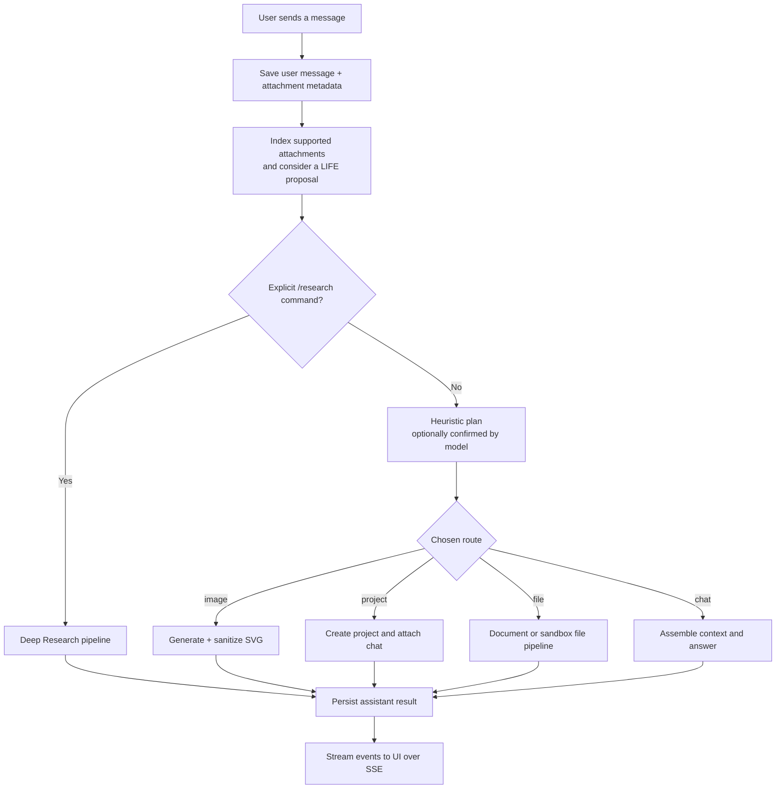
```mermaid
flowchart TD
    send["User sends a message"] --> persist["Save user message + attachment metadata"]
    persist --> memory["Index supported attachments<br/>and consider a LIFE proposal"]
    memory --> research{"Explicit /research command?"}

    research -->|"Yes"| deep["Deep Research pipeline"]
    research -->|"No"| plan["Heuristic plan<br/>optionally confirmed by model"]

    plan --> route{"Chosen route"}
    route -->|"image"| svg["Generate + sanitize SVG"]
    route -->|"project"| project["Create project and attach chat"]
    route -->|"file"| file["Document or sandbox file pipeline"]
    route -->|"chat"| answer["Assemble context and answer"]

    deep --> save["Persist assistant result"]
    svg --> save
    project --> save
    file --> save
    answer --> save
    save --> stream["Stream events to UI over SSE"]
```

Important boundaries:

- Chat does **not** have a direct route for starting an agent or running a workflow.
- Chat does **not** create dashboards. When the model-guided capability flag is enabled, it can query data or refresh an existing dashboard.
- `/research` is an explicit command, not an automatic mode. Web access within it still requires the
  workspace feature and explicit Web consent for that message; without consent it is document-only.
- A client disconnect does not cancel generation: the in-process run continues and persists the answer. The user must press Stop to cancel it.
- Only detached chat runs currently create rows in the Task Brain ledger, despite the broader wording in that module's docstring.

Code anchors: `backend/features/chat/router.py`, `backend/features/taskrouter.py`, `backend/features/chat/runs.py`, `backend/features/taskbrain.py`.

---

## 6. Chat context assembly

Orrery keeps instruction authority separate from retrieved material. Project instructions are trusted context; documents, web results, database rows, and tool output are untrusted reference data.

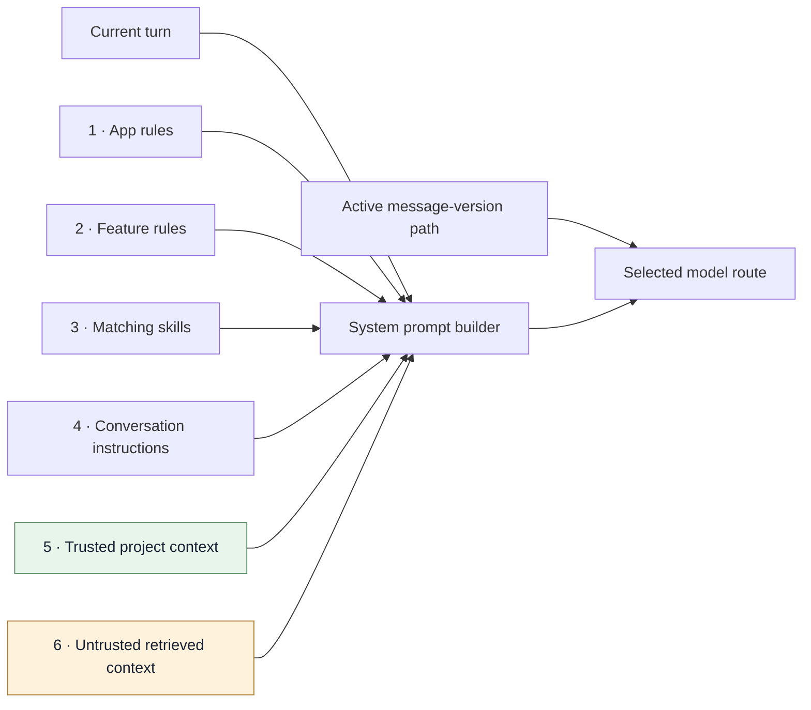
```mermaid
flowchart LR
    request["Current turn"] --> builder["System prompt builder"]
    rules["1 · App rules"] --> builder
    feature["2 · Feature rules"] --> builder
    skills["3 · Matching skills"] --> builder
    prefs["4 · Conversation instructions"] --> builder
    project["5 · Trusted project context"] --> builder
    rag["6 · Untrusted retrieved context"] --> builder
    history["Active message-version path"] --> model["Selected model route"]
    builder --> model

    classDef trusted fill:#e8f5ea,stroke:#5b8a64,color:#172033;
    classDef untrusted fill:#fff2dc,stroke:#aa7b2c,color:#172033;
    class project trusted;
    class rag untrusted;
```

Retrieval searches these collections together when relevant:

1. The collection selected with “use my data”.
2. Files attached to the current project.
3. Files previously uploaded to this conversation.
4. Connected ontologies, when enabled.

The active conversation path is a tree of message versions. Edit/regenerate creates siblings; only the active branch is sent back to the model. The recent history tail is bounded, and older uploaded files return through retrieval rather than being inlined forever.

`LIFE.md` is **not currently injected into normal Chat prompts**. Chat can asynchronously propose learned facts, but the user must approve the exact diff in Settings before the file changes.

Code anchors: `backend/features/prompting.py`, `backend/features/chat/retrieval.py`, `backend/features/chat/router.py`, `backend/features/chat/versioning.py`, `backend/features/life_learn.py`.

---

## 7. Model routing

All model-backed features call the same provider boundary. That boundary applies privacy handling, authentication, streaming, reasoning separation, usage metering, and one limited fallback rule.

Key-gated providers are Anthropic, OpenAI, Google, Mistral, DeepSeek, xAI (Grok), Alibaba DashScope (Qwen and GLM), and OpenRouter. Each provider's catalogue is fetched from the provider itself and curated to roughly four models per tier, so new model releases appear without a code change; DeepSeek falls back to its two long-standing models only when its API cannot be reached. Ollama is discovered locally and needs no key. `model_context_window()` consults LiteLLM's metadata, whose import costs seconds and therefore never runs on the event loop — startup warms it in a worker thread and `/api/models` computes windows off-loop.

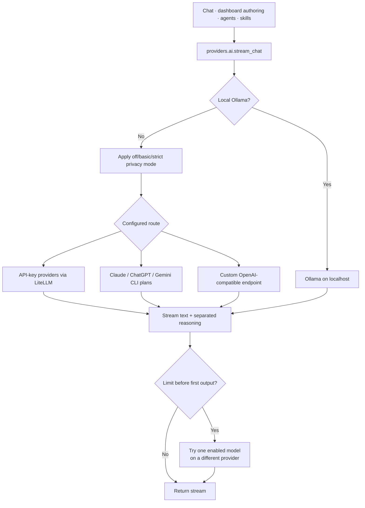
```mermaid
flowchart TD
    call["Chat · dashboard authoring · agents · skills"] --> provider["providers.ai.stream_chat"]
    provider --> privacy{"Local Ollama?"}
    privacy -->|"Yes"| local["Ollama on localhost"]
    privacy -->|"No"| redact["Apply off/basic/strict privacy mode"]
    redact --> route{"Configured route"}
    route --> keys["API-key providers via LiteLLM"]
    route --> plans["Claude / ChatGPT / Gemini CLI plans"]
    route --> custom["Custom OpenAI-compatible endpoint"]

    keys --> stream["Stream text + separated reasoning"]
    plans --> stream
    custom --> stream
    local --> stream
    stream --> fallback{"Limit before first output?"}
    fallback -->|"Yes"| once["Try one enabled model<br/>on a different provider"]
    fallback -->|"No"| done["Return stream"]
    once --> done
```

API-key providers in code: Anthropic, OpenAI, Google, Mistral, DeepSeek, and OpenRouter. Local models use Ollama. Custom routes must pass the server-side URL safety check and expose an OpenAI-compatible API.

The fallback is deliberately narrow: it happens only for recognized provider-limit failures, only before any output is emitted, only for text-compatible input, and only once.

Code anchors: `backend/providers/ai.py`, `backend/providers/accounts.py`, `backend/providers/catalog.py`, `backend/security/privacy.py`, `backend/security/netguard.py`, `backend/features/usage.py`.

---

## 8. The Chat tool loop

The model requests tools through fenced JSON blocks. The backend parses the request and enforces the turn's allow-list before executing it.

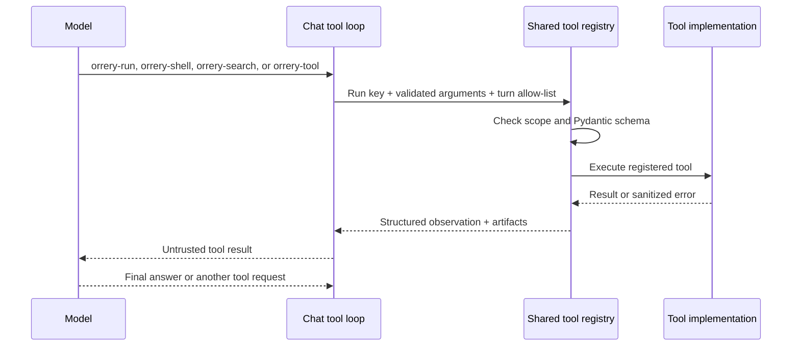
```mermaid
sequenceDiagram
    participant M as Model
    participant L as Chat tool loop
    participant R as Shared tool registry
    participant T as Tool implementation

    M->>L: orrery-run, orrery-shell, orrery-search, or orrery-tool
    L->>R: Run key + validated arguments + turn allow-list
    R->>R: Check scope and Pydantic schema
    R->>T: Execute registered tool
    T-->>R: Result or sanitized error
    R-->>L: Structured observation + artifacts
    L-->>M: Untrusted tool result
    M-->>L: Final answer or another tool request
```

Registered tools:

| Tool | Purpose | Main enforcement |
|---|---|---|
| `web_search` | Current web lookup | Workspace gate, explicit per-turn consent, query screening, turn allow-list. |
| `doc_search` | Search a collection | Collection resource constraint for agents. |
| `db_query` | One read-only query | SQL parse gate plus database-enforced read-only path. |
| `run_python` | Python in Docker | Offline hardened container and output caps. |
| `run_shell` | Shell in Docker | Same hardened container. |
| `file_generate` | Produce validated files | Sandbox, format validators, and artifact storage. |
| `crabbox_run` | Optional external executor | Off by default; destructive risk. |
| `dashboard_refresh` | Run an existing dashboard | Dashboard resource constraint for agents. |
| `mcp_call` | Call a stdio MCP tool | Chat advertises only enabled/approved servers; server-specific secrets and a minimal child environment; agent grants can constrain the server ID. |

Current Chat gating matters:

- Web search and approved MCP calls can be offered without the model-guided capability flag.
- File, data, document, dashboard, and Crabbox tools are added only when `capability_agent` is enabled; it defaults to off.
- Web and approved MCP tools can enter the model/tool loop without Docker. Python and shell tools are
  advertised only when the current versioned sandbox image is ready and Chat code execution is
  enabled. The loop itself is provider-agnostic, so this rule is the same for API, CLI-plan, and local
  models.
- The Activity panel renders the current turn's SSE events in order, but that browser projection is
  not an authoritative durable event log. The durable record is the evidence layer described in §17a;
  the panel is a view of a turn in progress, not the record of it.
- Python and shell run against sandbox scratch/input/output mounts. Orrery does not currently grant
  a model access to a local checkout: there is no explicit coding root, project file read/search/edit
  tool set, workspace-mounted command, LSP service, persistent terminal, or child-agent hierarchy.

Code anchors: `backend/features/code_interpreter.py`, `backend/features/capabilities.py`,
`backend/tools/registry.py`, `backend/tools/builtin.py`, `backend/features/chat/router.py`,
`ui/src/lib/activityLog.js`, `ui/src/views/Chat.jsx`.

---

## 9. File and small-app generation

Documents may use the deterministic document builder. Code-heavy files and small apps use a repairable model → sandbox → validation pipeline.

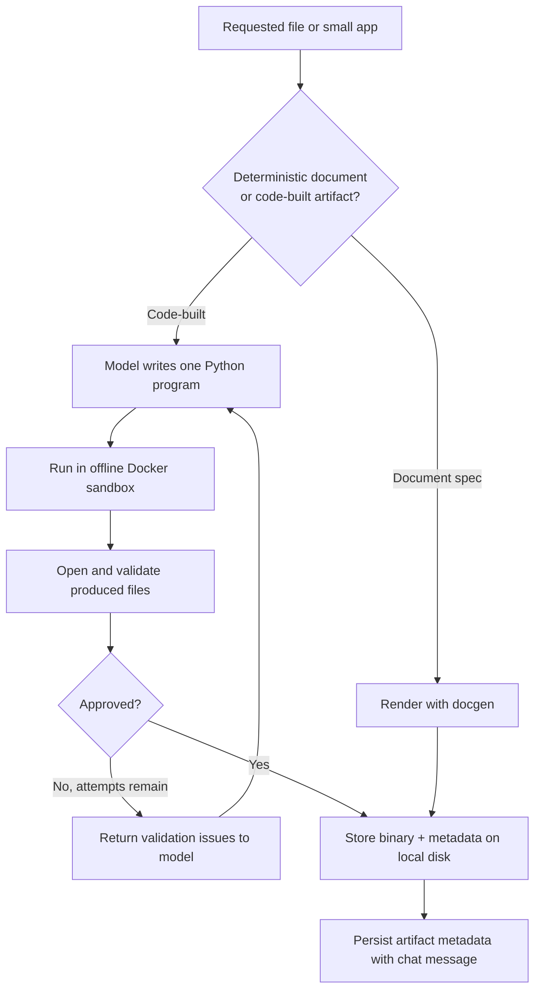
```mermaid
flowchart TD
    request["Requested file or small app"] --> choose{"Deterministic document<br/>or code-built artifact?"}
    choose -->|"Document spec"| doc["Render with docgen"]
    choose -->|"Code-built"| code["Model writes one Python program"]
    code --> sandbox["Run in offline Docker sandbox"]
    sandbox --> validate["Open and validate produced files"]
    validate --> ok{"Approved?"}
    ok -->|"No, attempts remain"| repair["Return validation issues to model"]
    repair --> code
    ok -->|"Yes"| store["Store binary + metadata on local disk"]
    doc --> store
    store --> chat["Persist artifact metadata with chat message"]
```

The Docker execution boundary uses no network, a read-only root filesystem, separate read-only
code/input mounts, a non-root user, dropped Linux capabilities, no privilege escalation,
CPU/memory/PID/open-file/time limits, and bounded scratch/output handoffs. Orrery refuses a stale
image version rather than silently running without current controls.

Small apps receive extra controls:

- A validated local bundle with `index.html` and at most 12 files.
- No external references, fetch/XHR/WebSocket, browser storage, inline event handlers, or unsupported browser capabilities.
- A ZIP for download plus a private extracted directory for preview.
- An opaque-origin iframe and a `connect-src 'none'` CSP when opened.

Generated files live under the per-user `tmp/generated` directory and expire after the configured TTL, seven days by default. File bytes are not stored in PostgreSQL.

Previews render locally with Python libraries so documents look like documents without any office
suite installed. Wherever the sandbox image exists that rendering happens **inside the offline
container**, not in this process: `office_render.py` is mounted read-only into the worker and run
there, so an attacker-supplied document is parsed with no network, a read-only root, a non-root user
and dropped capabilities. A sandbox failure produces a notice, never a host parse. The in-process
renderers survive only where no image exists, and OpenDocument has no host path at all — `odfpy`
ships in the image and deliberately not on the host, so ODT/ODS/ODP are a capability the worker
provides rather than one it merely protects.

Format by format: PDFs rasterize to page images (pypdfium2 in the container, QtPdf on a host without
one); Word previews keep run
formatting (bold/italic/underline/color), alignment, and bounded inline images; Excel previews keep
merged cells, cell styles, and column widths; PowerPoint previews position each shape on the slide
with its text styling, pictures, and tables; CSV/TSV render as real tables; and Markdown renders as
HTML with raw HTML escaped and remote image loading disabled; and ODT/ODS/ODP render through
`odfpy`, with ODP as an outline per slide rather than positioned shapes. When LibreOffice is
installed, OOXML files convert to PDF for page-faithful pages instead — an enhancement, not a
requirement, and `office_preview_status()` reports it that way. All preview parsing runs under fixed
input, node, cell, and output budgets.

Code anchors: `backend/features/docgen.py`, `backend/features/filegen.py`, `backend/features/sandbox.py`, `backend/features/files.py`, `backend/features/filepreview.py`.

---

## 10. Connected data and imported datasets

External database connections remain external. Imports are copied into isolated schemas inside Orrery's PostgreSQL so dashboards can query them through the same read-only interface.

### External connections

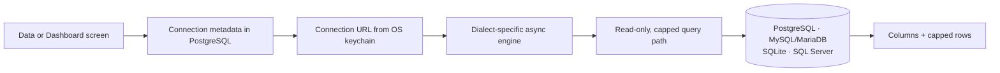
```mermaid
flowchart LR
    ui["Data or Dashboard screen"] --> meta["Connection metadata in PostgreSQL"]
    meta --> secret["Connection URL from OS keychain"]
    secret --> engine["Dialect-specific async engine"]
    engine --> readonly["Read-only, capped query path"]
    readonly --> db[("PostgreSQL · MySQL/MariaDB<br/>SQLite · SQL Server")]
    db --> rows["Columns + capped rows"]
```

Read-only enforcement differs by dialect:

- PostgreSQL: `SET TRANSACTION READ ONLY` plus an 8-second statement timeout.
- MySQL/MariaDB: read-only session initialization plus a best-effort execution timeout.
- SQLite: `PRAGMA query_only = ON`.
- SQL Server: no session read-only mode is available here; Orrery relies on a read-only login and the single-SELECT parser used by dashboard/tool paths.

### Imported datasets

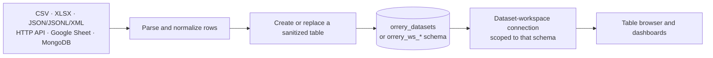
```mermaid
flowchart LR
    source["CSV · XLSX · JSON/JSONL/XML<br/>HTTP API · Google Sheet · MongoDB"] --> parse["Parse and normalize rows"]
    parse --> materialize["Create or replace a sanitized table"]
    materialize --> schema[("orrery_datasets<br/>or orrery_ws_* schema")]
    schema --> conn["Dataset-workspace connection<br/>scoped to that schema"]
    conn --> dashboards["Table browser and dashboards"]
```

API headers and MongoDB URIs are stored in the keychain. Dataset API URLs pass the server-side network guard; in team mode, imports cannot probe private or loopback networks. Values are parameterized and identifiers are sanitized during materialization.

Code anchors: `backend/features/data.py`, `backend/features/datasets.py`, `backend/security/netguard.py`.

---

## 11. Document ingestion and retrieval

Large document uploads are spooled to disk and queued. Retrieval combines vector similarity and PostgreSQL full-text search, then drops unrelated vector hits.

### Ingestion

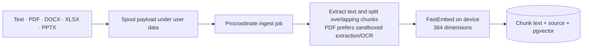
```mermaid
flowchart LR
    upload["Text · PDF · DOCX · XLSX · PPTX"] --> spool["Spool payload under user data"]
    spool --> queue["Procrastinate ingest job"]
    queue --> extract["Extract text and split overlapping chunks<br/>PDF prefers sandboxed extraction/OCR"]
    extract --> embed["FastEmbed on device<br/>384 dimensions"]
    embed --> chunks[("Chunk text + source + pgvector")]
```

### Retrieval

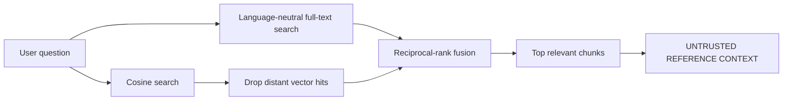
```mermaid
flowchart LR
    query["User question"] --> vector["Cosine search"]
    query --> keyword["Language-neutral full-text search"]
    vector --> gate["Drop distant vector hits"]
    keyword --> fuse["Reciprocal-rank fusion"]
    gate --> fuse
    fuse --> top["Top relevant chunks"]
    top --> untrusted["UNTRUSTED REFERENCE CONTEXT"]
```

Each collection records its embedding model so older and newer collections can be searched in the
correct vector space. Re-uploading the same source replaces its chunks transactionally. PDFs prefer
the versioned offline sandbox and run OCR only on pages without usable embedded text. Untrusted
document work is moving behind the bounded worker one path at a time: Office ingestion is
worker-first, and PDF page rendering for previews now runs in the container via pypdfium2, where a
sandbox failure yields no preview rather than a host parse and the in-process QtPdf renderer
survives only where no sandbox image exists. Office HTML rendering moved the same way, so the only
untrusted-document parsing left on the host is the optional LibreOffice conversion — which is a
separate process, is never required, and is absent by default.

Code anchors: `backend/features/rag.py`, `backend/features/chat/retrieval.py`, `backend/core/models.py`, `backend/core/queue.py`.

---

## 12. Dashboard lifecycle

The model designs a saved specification; it does not render live data itself. Every open or refresh runs the saved SQL again through the read-only data layer.

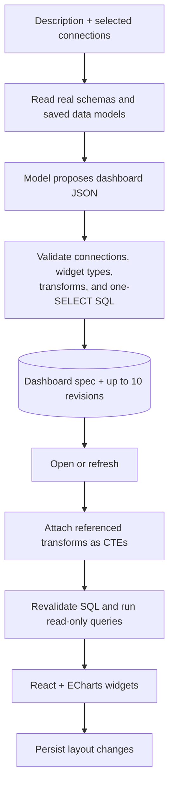
```mermaid
flowchart TD
    prompt["Description + selected connections"] --> schemas["Read real schemas and saved data models"]
    schemas --> model["Model proposes dashboard JSON"]
    model --> clean["Validate connections, widget types,<br/>transforms, and one-SELECT SQL"]
    clean --> save[("Dashboard spec + up to 10 revisions")]
    save --> open["Open or refresh"]
    open --> cte["Attach referenced transforms as CTEs"]
    cte --> query["Revalidate SQL and run read-only queries"]
    query --> charts["React + ECharts widgets"]
    charts --> layout["Persist layout changes"]
```

One broken widget produces a local widget error rather than failing the whole dashboard. Revisions are model-assisted; ordinary refreshes make no model call. Cross-connection joins are not allowed inside one transform.

Code anchors: `backend/features/dashboards.py`, `backend/features/datamodels.py`, `backend/features/data.py`, `ui/src/views/Dashboards.jsx`.

---

## 13. Agent execution

Agents are implemented as durable, version-pinned model/tool loops. A run never receives more tools than its saved grants allow.

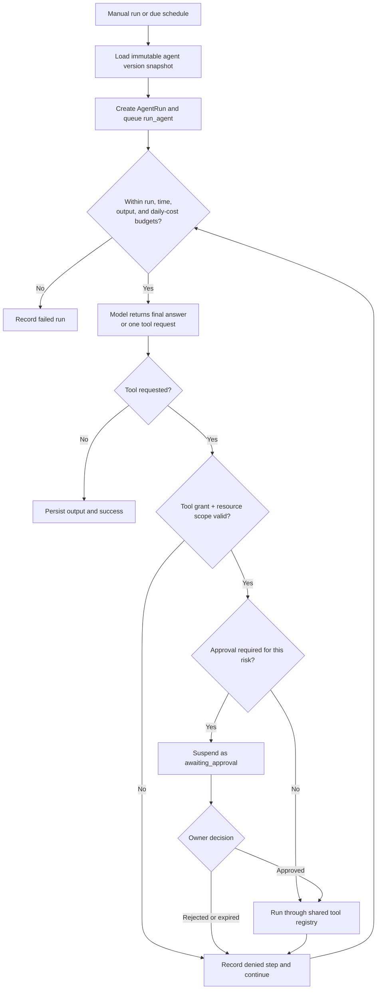
```mermaid
flowchart TD
    trigger["Manual run or due schedule"] --> snapshot["Load immutable agent version snapshot"]
    snapshot --> queue["Create AgentRun and queue run_agent"]
    queue --> budget{"Within run, time,<br/>output, and daily-cost budgets?"}
    budget -->|"No"| failed["Record failed run"]
    budget -->|"Yes"| model["Model returns final answer<br/>or one tool request"]
    model --> final{"Tool requested?"}
    final -->|"No"| success["Persist output and success"]
    final -->|"Yes"| grant{"Tool grant + resource scope valid?"}
    grant -->|"No"| trace["Record denied step and continue"]
    grant -->|"Yes"| approval{"Approval required for this risk?"}
    approval -->|"Yes"| wait["Suspend as awaiting_approval"]
    approval -->|"No"| tool["Run through shared tool registry"]
    wait --> decision{"Owner decision"}
    decision -->|"Approved"| tool
    decision -->|"Rejected or expired"| trace
    tool --> trace
    trace --> budget
```

Implemented triggers are:

- Manual runs from the Agents UI.
- Cron schedules checked once per minute by the queue worker.

The data model and builder accept `api`, `slack`, and `gmail` trigger modes and connector grants, but there is no inbound agent API, Slack receiver, or Gmail receiver registered in this codebase. `AgentApiCredential` storage exists but is not used by a route. Likewise, agent `life_access` settings are validated but not consumed by the current run loop.

Code anchors: `backend/features/agents.py`, `backend/features/agent_runs.py`, `backend/api/routes_agents.py`, `backend/core/queue.py`, `backend/core/models.py`.

---

## 14. Automation engine and read/run product surface

The workflow domain, authenticated API, queued executor, and read/run screen are connected. The
screen can create, select, pause/resume, delete, and manually run workflows; it renders the saved
spec, the registry-derived node palette, run history, and durable per-node steps. Canvas authoring is
the remaining product gap.

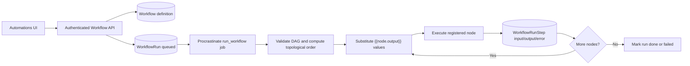
```mermaid
flowchart LR
    ui["Automations UI"] --> api["Authenticated Workflow API"]
    api --> store[("Workflow definition")]
    api --> run[("WorkflowRun queued")]
    run --> queue["Procrastinate run_workflow job"]
    queue --> topo["Validate DAG and compute topological order"]
    topo --> node["Substitute {{node.output}} values"]
    node --> execute["Execute registered node"]
    execute --> step[("WorkflowRunStep input/output/error")]
    step --> more{"More nodes?"}
    more -->|"Yes"| node
    more -->|"No"| finish["Mark run done or failed"]
```

The API exposes list/create/get/update/delete, manual run start, run list/detail, and the registered
node catalog. Registered node types are `llm_prompt`, `search_docs`, `db_query`, `http_request`,
`run_python`, `run_shell`, `web_search`, `if_branch`, `delay`, `refresh_dashboard`, and `mcp_tool`.

Current gaps are explicit:

- There is no canvas authoring: nodes, edges, configuration, and positions cannot be changed in the UI.
- A gated Automation tool call fails its run, because headless workflow runs cannot pause for a user
  decision. `run_tool` reports a refusal by returning `{"ok": false, ...}` rather than raising, so
  the engine reads that contract explicitly (`_refusal`): the step is recorded `failed` with the
  refusal — including any approval payload — and the run ends `failed`. There is still no way to
  answer the approval; the run has to be started again once the decision exists.
- The saved workflow `schedule` field has no schedule tick.
- Trigger/retry and connector behavior exists only where a registered node or runtime path implements it.

Code anchors: `backend/features/workflows.py`, `backend/automation/engine.py`,
`backend/automation/nodes.py`, `backend/api/routes_workflows.py`, `backend/api/__init__.py`,
`ui/src/views/Automations.jsx`, `ui/src/lib/api.js`.

---

## 15. Durable background work

Only work that is actually registered with the queue is shown here.

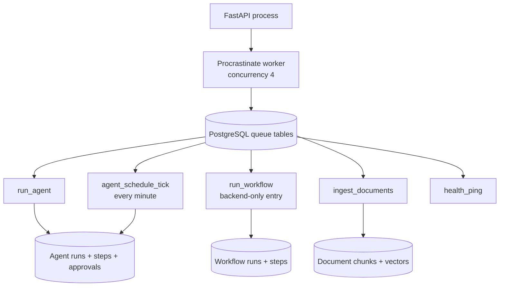
```mermaid
flowchart TB
    api["FastAPI process"] --> worker["Procrastinate worker<br/>concurrency 4"]
    worker --> pg[("PostgreSQL queue tables")]

    pg --> agent["run_agent"]
    pg --> workflow["run_workflow<br/>backend-only entry"]
    pg --> ingest["ingest_documents"]
    pg --> tick["agent_schedule_tick<br/>every minute"]
    pg --> health["health_ping"]

    agent --> ar[("Agent runs + steps + approvals")]
    workflow --> wr[("Workflow runs + steps")]
    ingest --> chunks[("Document chunks + vectors")]
    tick --> ar
```

Chat generation is different: it is detached into an in-process `asyncio.Task`, not placed on Procrastinate. It survives navigation and client disconnects but not a backend process exit. On the next launch, stale running Task Brain rows are marked interrupted.

Code anchors: `backend/core/queue.py`, `backend/features/chat/runs.py`, `backend/features/taskbrain.py`, `backend/features/agent_runs.py`.

---

## 16. Storage ownership

```mermaid
flowchart TB
    pg[("Orrery PostgreSQL")]
    pg --> p1["Chats · projects · messages · versions"]
    pg --> p2["Collections · chunks · embeddings"]
    pg --> p3["Connections metadata · datasets · dashboards"]
    pg --> p4["Skills · MCP metadata · feature settings"]
    pg --> p5["Agents · approvals · workflows · queue jobs"]
    pg --> p6["Team users · LIFE proposals · usage events"]

    keychain["OS keychain"]
    keychain --> k1["Main PostgreSQL URL"]
    keychain --> k2["Provider and custom-model keys"]
    keychain --> k3["External DB URLs · dataset secrets"]
    keychain --> k4["MCP environment values · team unlock key"]

    disk["Per-user data directory"]
    disk --> d1["LIFE.md + content-addressed history"]
    disk --> d2["Generated files + app bundles + previews"]
    disk --> d3["Ingestion spool · logs"]
```

External database rows remain in their original systems unless the user explicitly imports them as datasets. Provider secrets, database passwords, MCP environment values, and team plaintext access keys are not stored in application tables.

Code anchors: `backend/core/models.py`, `backend/security/secrets.py`, `backend/features/files.py`, `backend/features/life.py`, `backend/features/datasets.py`.

---

## 17. Security boundaries

### Cloud model boundary

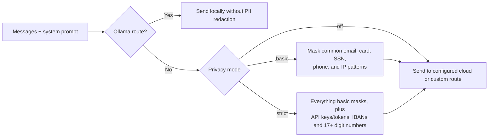
```mermaid
flowchart LR
    assembled["Messages + system prompt"] --> local{"Ollama route?"}
    local -->|"Yes"| ollama["Send locally without PII redaction"]
    local -->|"No"| mode{"Privacy mode"}
    mode -->|"off"| cloud["Send to configured cloud or custom route"]
    mode -->|"basic"| redact["Mask common email, card, SSN,<br/>phone, and IP patterns"]
    mode -->|"strict"| strict["Everything basic masks, plus<br/>API keys/tokens, IBANs,<br/>and 17+ digit numbers"]
    redact --> cloud
    strict --> cloud
```

“Strict” is a superset of “basic” by construction: `redact_strict` runs `redact` first and only adds
to it, then applies the same secret scrubber used on the web-search boundary plus IBAN and long
account-number patterns. Those extras have a higher false-positive rate on purpose — that is the
trade a user accepts when the content is sensitive. Both modes cover the system prompt as well as
message bodies, because project and retrieved context ride there. Local routes are exempt in every
mode, since nothing leaves the machine.

### Generated preview boundary

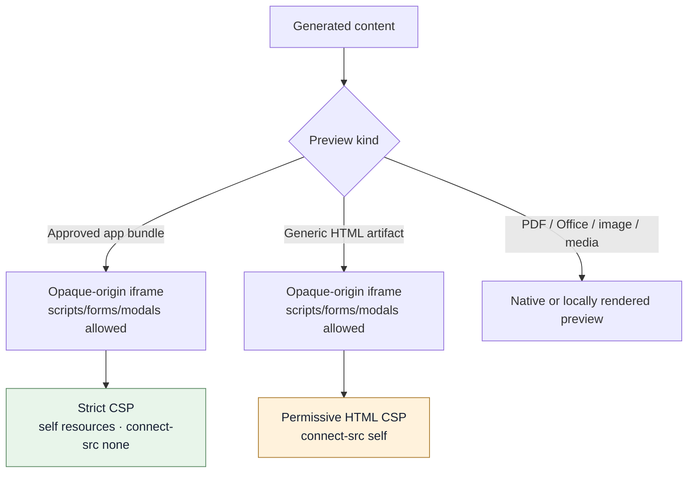
```mermaid
flowchart TB
    generated["Generated content"] --> kind{"Preview kind"}
    kind -->|"Approved app bundle"| app["Opaque-origin iframe<br/>scripts/forms/modals allowed"]
    app --> strict["Strict CSP<br/>self resources · connect-src none"]
    kind -->|"Generic HTML artifact"| html["Opaque-origin iframe<br/>scripts/forms/modals allowed"]
    html --> permissive["Permissive HTML CSP<br/>connect-src self"]
    kind -->|"PDF / Office / image / media"| inert["Native or locally rendered preview"]

    classDef stronger fill:#e8f5ea,stroke:#5b8a64,color:#172033;
    classDef caution fill:#fff2dc,stroke:#aa7b2c,color:#172033;
    class strict stronger;
    class permissive caution;
```

The app-bundle path has the strong no-egress contract. Generic HTML previews do **not** have the same CSP: they allow inline script/eval and broad image/media/font sources, although the opaque-origin iframe prevents access to the parent workspace and `connect-src` is limited to self.

Other implemented controls include:

- Loopback-only API binding and a fresh session token per launch, handed to the browser as a
  single-use launch code traded for an httpOnly cookie, with an Origin check on every
  cookie-authenticated request.
- Request-size caps, no API docs/OpenAPI surface, CSP, frame, MIME-sniffing, and referrer headers.
- OS-keychain secret storage and error-string secret scrubbing.
- Team keys stored as SHA-256 hashes; the local unlock copy stays in the keychain.
- Owner filtering for private team resources and admin approval for member-authored skills/MCP servers.
- Server-side URL guards for custom model endpoints and import/HTTP fetches. Dataset imports and the
  Automation HTTP node use a guarded fetch that re-validates every redirect hop (scheme, credentials,
  host, port, every resolved address), pins the connection to the validated IP, streams the body into
  a hard byte cap, and drops custom auth headers when a redirect leaves the original host.
- A central registry-level approval gate for non-Agent tool side effects: external/destructive tools
  (MCP calls, Crabbox) pause the chat turn for an inline user decision bound to the sha256 digest of
  the exact validated arguments — single-use, expiring, replay-refused. Read-only and sandboxed tools
  never prompt; "always allow" is remembered per owner (per server+tool for MCP), and
  destructive-risk tools are never rememberable — they ask every time. Agent runs keep their own
  durable AgentApproval flow.
- Identity and authorization fail closed: a database/config error reports team mode with a locked
  identity (never solo-admin), disables all feature gates for team callers, and refuses team
  bootstrap unless a successful query proves the team table is empty.
- Dataset API source URLs never persist credentials: secret-looking query parameters are stripped to
  the OS keychain, only a redacted canonical URL is stored/returned (legacy rows are redacted on
  read), refresh resolves the real URL from the keychain, and connector errors are scrubbed.
- Untrusted-context labeling for retrieved documents and tool output.
- Read-only query enforcement and row/time caps for connected data.
- Hardened offline Docker execution for model-written code.
- Approved MCP processes launch without a shell, inherit only a small runtime environment plus their
  own keychain secrets, bound messages/output, and have timed-out process groups terminated.
- Chat web search is disabled by default per message; its bounded query is screened for common PII
  and secrets before the third-party search call.

Known security gaps are kept explicit rather than hidden in separate review documents:

- Pending tool approvals live in memory, like detached chat runs: a backend restart clears them and
  the affected tool call fails safely. Headless Automation runs cannot pause for a decision, so a
  gated node fails its run with an approval-required error until durable Automation approval
  pause/resume and its decision UI exist. The refusal is visible in the run-debug view, but no
  screen lets a user act on it, so the approval expires undecided.
- Every Automation node that reaches outside Orrery now does so through `run_tool`, so the scope
  allow-list, deny-only hook, risk tiering, and evidence layer apply to all of them. The one
  remaining exception is `llm_prompt`, which calls the provider layer directly: it is covered by the
  privacy boundary and model routing but not by the tool registry.
- The "always allow" tool list is enforced per owner but is editable only by re-approving; a
  management UI to review/revoke remembered grants has not been built yet.
- Admin feature flags are enforced on the server for the surfaces whose flag names that surface:
  the Agents, Automations, Dashboards, and MCP routers each carry a `require_feature` dependency and
  answer 403 when their flag is off, so hiding the React tab is no longer the only control. The gate
  fails closed on an unreadable flag state. Administration and the route that reports the flags are
  deliberately not gated, or turning everything off would be unrecoverable. `ontology` still gates
  only ontologies-as-chat-context rather than collection CRUD, and Media Hub has no backend to gate.

Code anchors: `backend/api/__init__.py`, `backend/security`, `backend/features/team.py`, `backend/features/prompting.py`, `backend/features/sandbox.py`, `ui/src/lib/officePreview.js`.

---

## 17a. Execution evidence (ADR-005 slice 1)

Chat, Agents, and Automations record what they asked a model and what they asked a tool, durably,
before either becomes visible. The point is not that something was logged — it is that the record
can be *reconstructed* and shown to be the same thing that ran.

Three tables carry it. `tool_call_contexts` is one immutable row per guarded tool call: surface,
owner, the parent (conversation, agent run, or workflow run), a turn id, the tool key, and a digest
of the validated arguments. `tool_lifecycle_events` is its append-only event stream, sequenced from
1, with `body_started` recorded before any terminal outcome. `model_request_envelopes` holds the
exact request handed to a provider.

```mermaid
flowchart LR
    caller["Chat · Agent · Automation<br/>passes an execution identity"] --> gate["run_tool guards<br/>scope · flag · grant · validation · hook · approval"]
    gate -->|refused| rec1["refusal recorded<br/>never_dispatched"]
    gate -->|authorized| adm["admit → body_started"]
    adm --> body["tool body runs"]
    body --> term["succeeded / failed / cancelled<br/>or unknown_outcome"]
```

Four properties are load-bearing:

- **Evidence never grants authority.** Every guard still decides. Recording happens around the
  decision, never instead of it.
- **It gates the body.** If the admission record cannot be written the call is refused as retry-safe
  rather than run unrecorded; if the outcome cannot be written after the body ran, the caller is told
  the effect is `unknown_outcome` rather than that it is safe to repeat.
- **A refusal is a record, not a silence.** A denied call opens its own record with
  `dispatch_state=never_dispatched`, so "was not allowed" and "never asked" are different answers.
- **The request envelope proves itself.** `proves()` rebuilds the envelope from what was stored and
  compares canonical-serialization digests, so key order and whitespace cannot make two different
  requests look alike. Capture is at the adapter boundary, after privacy redaction and route
  selection, and deliberately excludes HTTP wire bytes so transport credentials never enter it. A
  request too large to keep still stores its digest.

Capture is opt-in per surface through a context variable, so a surface nobody wired records nothing.
Chat and Agents pass an identity explicitly; Automation nodes execute through a fixed signature and
cannot be handed one, so the engine scopes an ambient identity around each node and resets it in
`finally`. Interrupted calls are reconciled at startup (`reconcile_incomplete_calls`).

Current limits, stated plainly: `parent_call_context_id`, `provider_call_id`, `grant_snapshot_ref`,
and `config_snapshot_ref` exist as columns but nothing populates them, so ADR-005's "retries and
forks retain exact lineage" is not yet met. Model-request envelopes are captured for Agents and for
Chat; Automations record tool evidence but no envelope. Records are owner-private, live in the same
PostgreSQL trust domain as the conversation or run they belong to, and are deleted with their parent.

Code anchors: `backend/tools/lifecycle.py`, `backend/providers/envelope.py`,
`backend/tools/registry.py`, `backend/features/code_interpreter.py`,
`backend/features/agent_runs.py`, `backend/automation/engine.py`,
`docs/decisions/005-coding-harness-capabilities.md`.

---

## 18. Composability: configuration layers, hooks, and plugins

Settings resolve through five ordered layers — defaults, an `orrery.toml` profile beside the project (or `ORRERY_PROFILE`), a `config.toml` in the per-user data directory, `.env`, then real environment variables, which always win. `backend/core/profiles.py` owns the layers; `orrery --dump-config` prints each setting with the layer that supplied it and redacts anything credential-shaped. No secret is read from or written to a layer — provider keys and the database URL stay in the OS keychain.

Two extension seams exist, both **deny-only** (ADR-004). `tools/pre-execute` runs inside `run_tool()` after every built-in guard — scope allow-list, feature gate, grant actions and resources, argument validation — and before the central approval gate, so it covers Chat, Automations, and Agents at once and a refusal never raises a pointless approval prompt. Its reach is exactly the set of calls that enter `run_tool`; the one Automation node still outside that set is `llm_prompt` (see §17). `agent/pre-step` runs before each model request in an agent run and can stop the run. A hook returning nothing has not approved anything; it has only declined to object, so removing every hook leaves behaviour exactly as strict.

A configuration layer may name plugins (`plugins = [...]`). A plugin is an importable module the user installed; mounting imports it and calls `setup(ctx)`, and the context exposes only the two hook registrations. Nothing is fetched — names that look like URLs or paths are refused before import. Registrations are recorded so unmounting reverses them, a `setup()` that raises part-way is rolled back, and a declared plugin that cannot be imported fails startup rather than running without the policy the user asked for.

Agent runs are reconstructible from their durable step log: `_transcript()` has always rebuilt the model-bound conversation from `agent_run_steps`, and `replay()` exposes that reconstruction while `fork_run()` branches a new queued run from it. A fork reuses the source run's version and config snapshot rather than the agent's current settings, and carried steps keep counting toward the step budget.

Code anchors: `backend/core/profiles.py`, `backend/core/plugins.py`, `backend/tools/hooks.py`, `backend/tools/registry.py`, `backend/features/agent_runs.py`, `docs/decisions/004-harness-composability.md`.

---

## 19. The honest implementation boundary

```mermaid
flowchart LR
    live["Live end-to-end"] --> a["Chat · projects · data · RAG"]
    live --> b["Dashboards · agents · skills · MCP"]
    live --> h["Automations read/run API + UI"]
    live --> c["Models · team/admin · settings · LIFE review"]

    partial["Present but incomplete"] --> d["Automations<br/>canvas editing · approval pause · schedule tick"]
    partial --> e["Media Hub<br/>static presentation only"]
    partial --> f["Agent API/Slack/Gmail triggers<br/>schema/config without receivers"]
    partial --> g["LIFE in agent config<br/>not used by run loop"]
```

In plain English: Orrery already has a substantial local-first core. Chat, retrieval, data,
dashboards, file generation, model routing, team controls, MCP, bounded agents, and the Automation
read/run path are implemented. The largest visible gaps are Automation authoring/approval/scheduling,
the static Media Hub, and the unregistered Agent API/Slack/Gmail receivers.

The ordered remediation and product roadmap are maintained only in [`PLAN.md`](PLAN.md); the current
unchecked work is maintained only in [`TODO.md`](TODO.md).

That distinction should remain visible in future diagrams so the architecture describes the software people can actually run—not the software the mockups imply.
